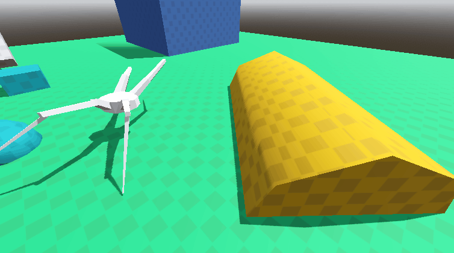
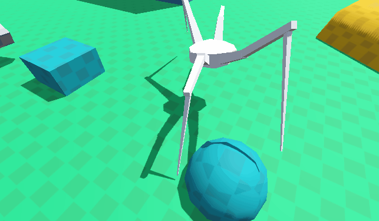
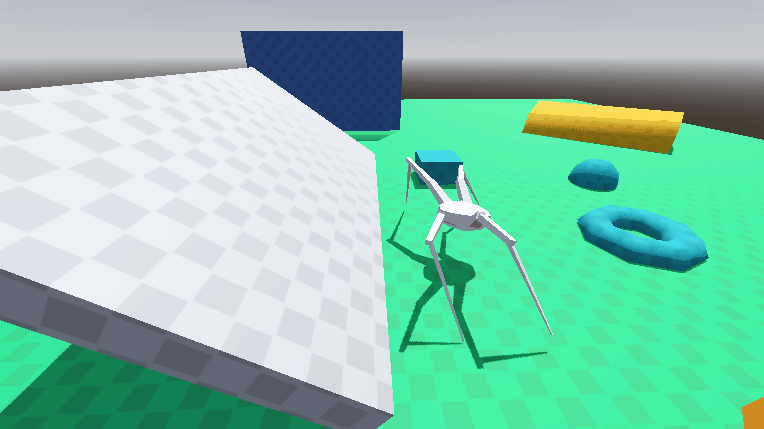

# 🕷️ Spider Procedural Animation

A Godot 4 experiment in procedural leg movement, using inverse kinematics.

PRs are very welcome.

> [!WARNING]
> It's a **foundation**/**demo**, not a finished system and not limited to spiders

